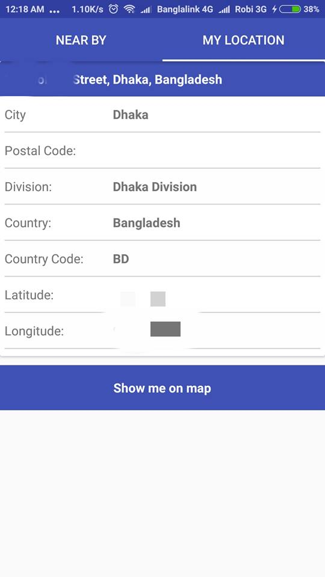
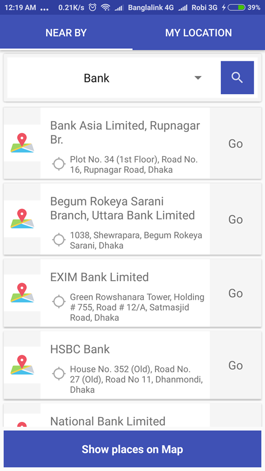
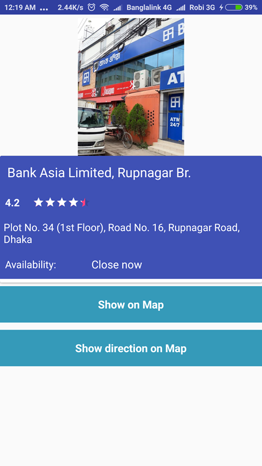
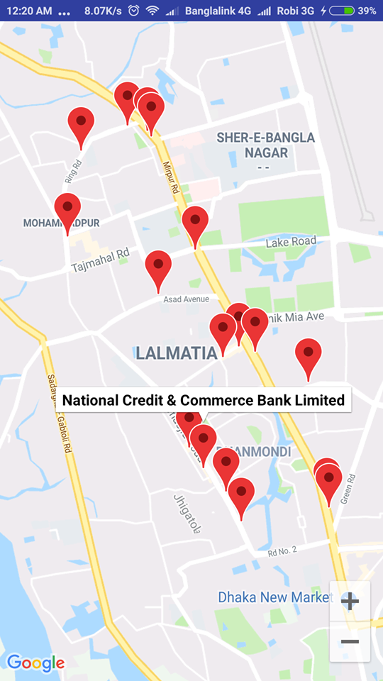
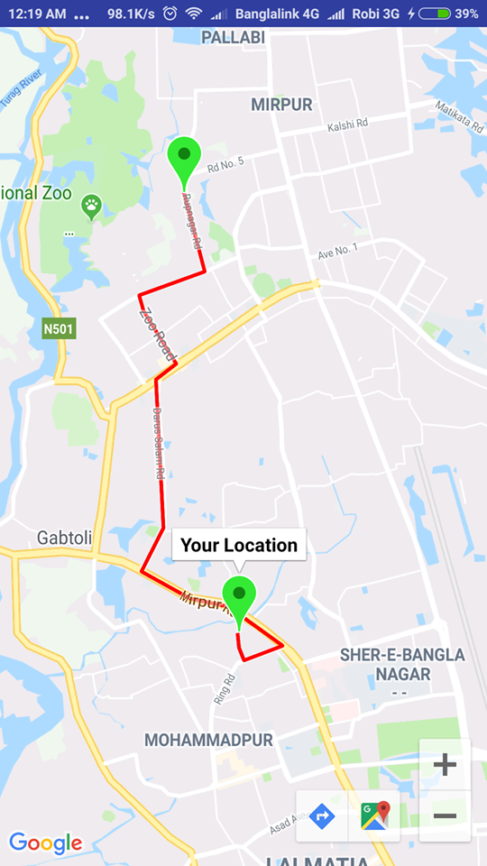

## Android Near by places app

# Preview

# show current location with details

# Near by places

# place details

# show all places in map

# show direction from current location

##### just add your map api in strings.xml file